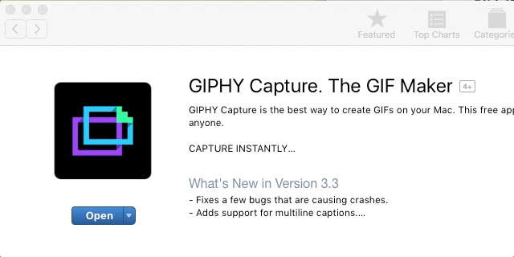
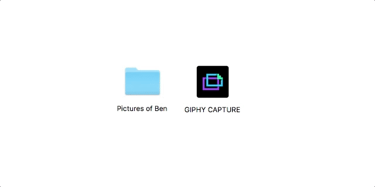
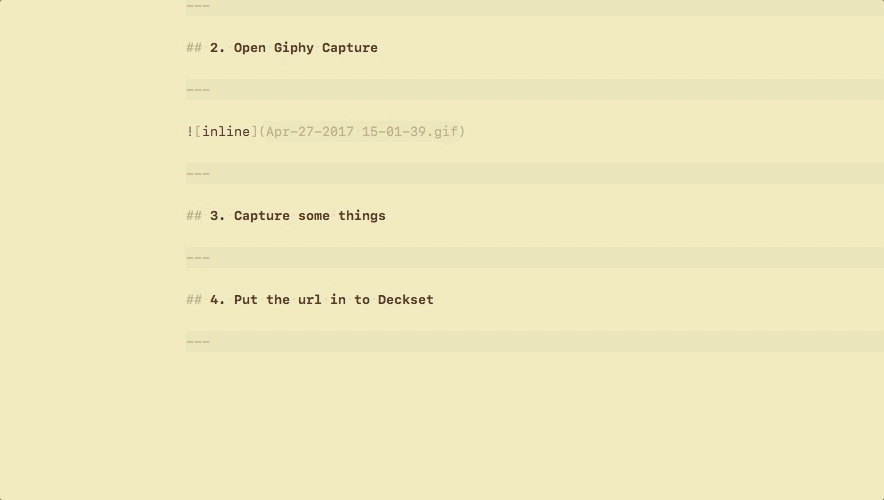
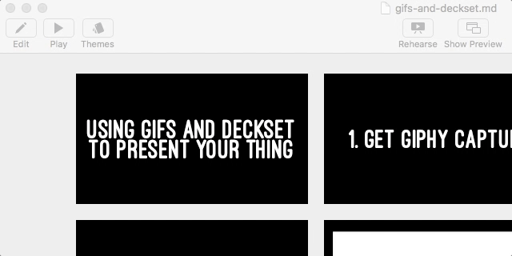

#[fit] Using gifs and deckset  to present your thing

---

## 1. Get Giphy Capture

---

---

## 2. Open Giphy Capture

---

---

## 3. Capture some things

---

---

## 4. Put the url in to Deckset

---

---

##[fit] OH̵ MYÍ€ ÍGODÍŸ THIÍS GOT  RȨAÍL̶LY Ì•M̧ET̶A ̧RE̸A̧LÌ¡LÌ›YÍ¢ FASTÌ´

---

## 5. Present 💯

---

